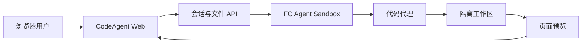

# CodeAgent FC Sandbox 架构概览

CodeAgent Sandbox 是一个浏览器中的代码代理工作台。它将代码代理运行在独立的阿里云 FC Agent Sandbox 中，让用户可以通过浏览器完成对话、代码修改、命令执行和页面预览。

本文面向使用和评估该示例的用户，介绍主要组件、典型流程和适用边界，不涉及内部实现细节。

## 核心架构

系统由以下部分组成：

- **浏览器界面**：展示对话、工具执行过程、文件变化和应用预览。
- **控制服务**：管理业务会话，转发消息、文件请求和预览请求。
- **FC Agent Sandbox**：为每个会话提供独立的代码执行环境。
- **代码代理**：在沙箱工作区中读取、修改和运行项目。
- **页面预览**：把沙箱内启动的 Web 应用映射回浏览器。

## 会话隔离

每个业务会话对应独立的 FC 沙箱和代码代理会话：

- 不同会话的工作目录相互隔离。
- 代码和命令只在对应沙箱中运行，不在控制服务宿主机执行。
- 正常多轮对话复用同一代理会话，保留连续上下文。
- 控制服务短暂重启后，会在运行环境仍有效时尝试恢复原会话。

## 文件与代码执行

用户通过浏览器查看文件和操作结果，实际文件读写与命令执行发生在沙箱工作区中。控制服务负责校验和转发请求，不直接执行用户项目。

代码代理可以在工作区内：

- 创建和修改文件；
- 安装项目依赖；
- 执行构建与测试；
- 启动开发服务器；
- 将运行中的 Web 应用发布到页面预览。

## 页面预览

页面应用由代码代理在沙箱中启动。发布成功后，浏览器通过固定的预览入口访问当前会话对应的应用。

这种方式支持常见的前端资源、客户端路由和 WebSocket 热更新，同时保持不同用户会话之间的预览隔离。

## 会话恢复

当控制服务重启或空闲连接释放时，系统会保存业务会话与运行环境的映射。只要原沙箱和代理会话仍然有效，下一次访问就会重新连接并继续原会话。

如果运行环境已经过期或被销毁：

- 启用持久化时，可以在新的沙箱中恢复工作区数据；
- 未启用持久化时，原沙箱中的临时数据无法恢复；
- 系统会明确报告恢复失败，不会把旧事件伪装成新的代理上下文。

## 适用边界

当前项目是用于展示 FC Agent Sandbox 与代码代理集成方式的示例，适合开发验证和受控演示。

在生产环境使用前，应根据实际安全要求补充身份认证、访问控制、网络隔离、密钥管理、审计和多实例数据一致性能力。

## 进一步阅读

- [README](./README.md)：安装、配置和运行说明
- [接口说明](./INTERFACES.md)：对外接口与数据结构
