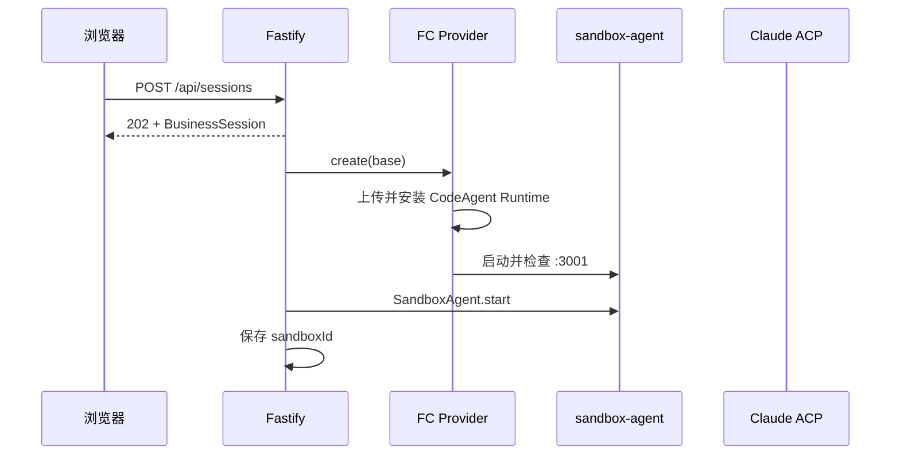

# CodeAgent FC Sandbox 内部详细设计

> 内部维护文档：记录实现、兼容性和运行边界，不作为客户使用指南。
> 面向使用者的整体说明请参阅 [架构概览](../ARCHITECTURE.md)。

## 1. 目标与边界

本项目提供一个浏览器中的代码代理工作台。Claude Code 必须运行在独立 FC Agent Sandbox 中，不能在控制面宿主机执行用户项目。控制面只负责业务会话、连接编排、事件持久化和 UI API。

当前版本的边界：

- FC Agent Sandbox 是唯一运行时，使用 E2B 兼容 SDK。
- 每个业务会话对应一个 FC 沙箱和一个 Claude 原生会话。
- 采用 FC 平台透明浅休眠：在沙箱有效期内由平台按空闲状态自动切换，控制面不调用 E2B pause。
- OSS 持久化可选；启用时每个业务会话使用独立前缀，原沙箱失效后可用同一前缀创建替代沙箱。
- Preview 使用固定 `5184` 网关；网关按浏览器 cookie 找到当前会话，把根路径 HTTP 与 WebSocket 转发到对应 FC 应用端口。
- Demo 使用公开端口和自动允许工具权限，暂不提供生产级安全隔离。

## 2. 总体结构

```mermaid
flowchart LR
  Browser[React 浏览器界面]
  API[Fastify 控制面]
  Business[(业务会话 JSON)]
  Events[(SDK 事件 JSON)]
  Provider[FcE2BSandboxProvider]
  FC[FC Agent Sandbox]
  SA[sandbox-agent :3001]
  ACP[claude-agent-acp]
  Claude[Claude Code]
  Workspace[/home/user/workspace]
  App[AI 启动的页面服务]

  Browser -->|HTTP / SSE| API
  API --> Business
  API --> Events
  API --> Provider
  Provider -->|E2B create/connect/getHost| FC
  API -->|sandbox-agent SDK| SA
  FC --- SA
  SA --> ACP
  ACP --> Claude
  Claude --> Workspace
  Claude --> App
  Browser -->|iframe Preview Gateway :5184| API
  API -.->|HTTP / WebSocket 根路径代理| App
```

### 2.1 控制面

Fastify 对外暴露会话、消息、事件、文件与 Preview 状态接口。`AgentSessionManager` 将业务会话映射为运行时句柄，并保证同一会话在同一时刻只执行一个 prompt。

控制面本地保存两类数据：

- `BusinessSessionStore`：保存 `sandboxId`、`sandboxProviderId`、`agentSessionId`、状态和模板名。
- `FileSessionPersistDriver`：保存 sandbox-agent 的 Session 记录和 ACP 事件，供 UI 增量展示及恢复时定位原生会话。

本地事件不是 Claude 上下文的权威来源。恢复时禁止把历史事件拼成新的用户消息。

### 2.2 FC Provider

`FcE2BSandboxProvider` 实现 sandbox-agent 的 `SandboxProvider`：

- `create()`：通过 E2B SDK 创建公开端口沙箱，注入 Claude 与工作目录环境变量。
- `connect()`：通过已有 `sandboxId` 重新连接沙箱，并确认 Runtime 与 agent server 健康。
- `getUrl()`：返回 `sandbox-agent` 的 `3001` 端口地址。
- `getPortUrl()`：返回任意已发布应用端口的上游地址，供健康检查和 Preview 网关转发。
- `destroy()`：显式销毁 FC 沙箱，仅在删除业务会话时调用。

Provider 不设置 `lifecycle.onTimeout: pause`。E2B 的 `pause + keepMemory` 会保存完整内存快照，属于深休眠；当前首期只使用 FC 在沙箱有效期内提供的透明浅休眠。`timeoutMs` 表示沙箱有效期，到期后沙箱终止；有效期内的 connect 或端口流量会唤醒浅休眠实例。

Provider 固定使用 FC 内置 `base` 模板。创建或重连沙箱后先检查 `/home/user/.codeagent-runtime/v2/.ready`；新沙箱会从控制面镜像上传 Runtime 文件，通过 npmmirror 安装固定版本的 Claude Code、sandbox-agent 与 Claude ACP，然后运行 `/usr/local/bin/start-sandbox-agent`。存活沙箱具备标记和二进制时跳过安装。

### 2.3 沙箱 Runtime

`sandbox_image/` 保存：

- `start-sandbox-agent` 与 `codeagent-preview`。
- Claude 的全局工作约定。

计算巢控制面 Docker 镜像携带这些文件，但不携带任何用户密钥。FC 内置 `base` 已提供 Node.js、Python、Git 和基础编译工具；Provider 在沙箱运行阶段补齐 CodeAgent 组件。因此最终用户不需要准备 ACR、源镜像或模板 ID。

## 3. 会话标识

同一个业务会话同时包含三类标识：

| 字段 | 归属 | 用途 |
| --- | --- | --- |
| `id` | 控制面 | API、SSE、文件与 UI 的稳定业务键 |
| `sandboxId` | FC | 重新连接或销毁实际沙箱 |
| `sandboxProviderId` | sandbox-agent | 形如 `fc-e2b/<sandboxId>` 的 Provider 映射 |
| `agentSessionId` | Claude/ACP | 用 `session/resume` 恢复 Claude 原生上下文 |

`userId` 与 `projectId` 目前只是业务元数据，不参与运行时路由。

## 4. 新建与多轮对话

### 4.1 新建



创建沙箱后，控制面初始化工作目录 Git 仓库和空基线提交。只有没有 `HEAD` 时才创建基线，重连不会重复提交。Claude 原生会话延迟到第一条用户消息才通过 `session/new` 创建并保存 `agentSessionId`。

### 4.2 正常多轮

运行时句柄仍在内存时，所有消息都调用同一个 `Session.prompt()`。Claude Code 自己维护上下文、工具状态和压缩后的会话历史，不需要前端或后端重放旧消息。

SSE 事件只承担显示职责：前端按 `eventIndex` 增量读取，并组合出消息、工具调用和文件操作动画。

## 5. 后端重启与原生恢复

后端进程退出不会主动销毁 FC 沙箱。重启后第一次访问该业务会话时：

1. 从业务存储读取原 `sandboxId` 和 `agentSessionId`。
2. 用 E2B `Sandbox.connect(sandboxId)` 连接同一个 FC 沙箱。
3. 确认 `sandbox-agent` 健康，并建立新的 HTTP/ACP 连接。
4. 调用 ACP `session/resume`，参数中的 `sessionId` 就是原 `agentSessionId`。
5. 将新连接绑定到原业务 `id`，后续 prompt 继续原 Claude 会话。

`native-claude-session.ts` 集中了对 sandbox-agent 0.4.0 私有连接接口的兼容访问。这样做是为了避免它的高层恢复方法创建新会话后再回放本地事件。升级 sandbox-agent 时，需要优先验证这层兼容边界。

恢复具有“失败即暴露”语义：若映射冲突、沙箱已销毁、Claude 会话不存在或 ACP 不支持 `session/resume`，会话进入失败状态；不会退化为 `session/new`。

## 6. 浅休眠

`AgentSessionManager` 为每个业务会话维护引用计数。消息、文件和 Preview 检查持有短期运行时租约；全部释放且经过 `FC_RUNTIME_IDLE_MS` 后，控制面仅执行 `sdk.dispose()`。沙箱仍在 `FC_E2B_TIMEOUT_MS` 有效期内时，FC 可以按平台策略自动进入透明浅休眠：

```text
无活跃调用
  -> 释放本地 SDK/ACP 连接
  -> FC 在有效期内按空闲状态进入透明浅休眠
  -> 下次 connect 或端口流量快速唤醒
  -> 控制面调用 session/resume
```

`FC_E2B_TIMEOUT_MS` 不是浅休眠延迟，而是沙箱有效期。到期终止后不能再连接原 `sandboxId`；启用 OSS 时可用同一隔离前缀创建替代沙箱并恢复，关闭 OSS 时明确失败。当前不配置内存快照深休眠。

前端在 AI 运行期间持续轮询 Preview；运行结束、切换会话或手动同步后，对未就绪状态保留 45 秒收敛重试窗口，ready 或窗口到期后停止。iframe 仅在 Preview 标签实际打开时挂载，避免 Vite HMR 长连接持续唤醒沙箱。

## 7. 文件与 Preview

### 7.1 文件

浏览器不直接访问沙箱文件系统，而是经 Fastify 调用 sandbox-agent 的文件与进程接口。所有路径都会归一化并限制在 `/home/user/workspace` 中。

前端只有观察到 AI 的真实读取、创建、写入或删除事件时才自动展开右侧产物区。文件写入动画按行推进；工作区快照用于发现最终文件状态，而不是推断 Claude 上下文。

### 7.2 Preview

页面服务必须由 AI 在项目目录中启动。以 Vite 为例：

```bash
npm run dev -- --host 0.0.0.0 --port 5173
codeagent-preview publish --port 5173 --cwd "$PWD" --name "Web Preview"
```

Vite 还必须设置 `server.allowedHosts: true`（当前 Demo 不考虑 Host 安全）；其他带 Host allowlist 的框架需要做等价配置。`codeagent-preview publish` 会用外部 Host 请求做发布前检查，公开端口只接受 `3000–65535`。

`codeagent-preview` 检查本机端口和 HTTP health path，然后原子写入：

```json
{
  "targetPort": 5173,
  "healthPath": "/",
  "projectRoot": "/home/user/workspace",
  "status": "ready"
}
```

后端状态接口读取该文件，用 `getHost(5173)` 生成 FC 上游 Origin 并检查健康，再将它注册到 `PreviewGateway`。浏览器通过状态请求提交稳定的 browser ID 和递增选择序号，服务端把当前业务会话写入同主机 cookie；iframe 始终从 `http://<控制面主机>:5184/` 打开应用。网关按 cookie 选择 FC 上游，转发 HTTP 和 WebSocket，并删除 FC 默认注入的 `Content-Disposition: attachment`，因此：

- 应用保持根路径 `/`；
- Vite HMR 和相对/绝对资源路径都在固定 Preview Origin 内工作；
- 不使用 `/api/.../preview` 这类路径前缀，避免破坏根路径资源和前端路由；
- 不需要通配域名；不同浏览器通过各自 cookie 同时预览不同会话。

后端重启时不主动连接全部沙箱。前端恢复当前会话后重新提交 cookie 绑定并读取预览清单，网关再延迟恢复 FC 上游。

## 8. 持久化与失效边界

| 场景 | 当前结果 |
| --- | --- |
| 控制面短暂断开或重启，FC 沙箱仍在 | 连接原沙箱并原生 resume |
| 空闲连接被释放，沙箱仍在有效期内并进入浅休眠 | 下一次 connect/端口流量唤醒，控制面再原生 resume |
| `FC_E2B_TIMEOUT_MS` 到期且 OSS 关闭 | 沙箱终止，原工作区和 Claude Session 无法恢复 |
| 原沙箱失效且 OSS 开启 | 用同一会话 prefix 创建替代沙箱，成功原生 resume 后切换正式 sandboxId |
| 控制面 `data/` 丢失 | 无法找到原业务映射和 UI 事件 |
| FC 沙箱被显式销毁或平台判定失效 | 文件系统和沙箱内 Claude 状态不可恢复 |
| Claude 原生会话失效 | 明确失败，不本地回放、不静默新建 |

单进程内，业务 JSON 和 SDK SessionRecord 都按会话串行写入，并通过随机独占临时文件、文件同步和原子替换落盘。如果控制面部署为多副本，`data/` 仍需替换为共享且具备跨进程并发控制的存储；当前 JSON 文件实现只面向单进程 Demo。

## 9. 已知限制

- 使用无 token 的 sandbox-agent 和公开应用端口，只适合受控 Demo。
- 权限请求默认选择 `always`，未实现用户审批。
- 没有深休眠快照或 NAS；跨沙箱恢复只支持可选的 FC 动态 OSS 挂载。
- 原生恢复依赖 sandbox-agent 0.4.0 的私有接口，需要在 SDK 升级时做回归测试。
- Session 和事件 JSON 没有跨进程锁，多实例控制面可能产生竞争。
